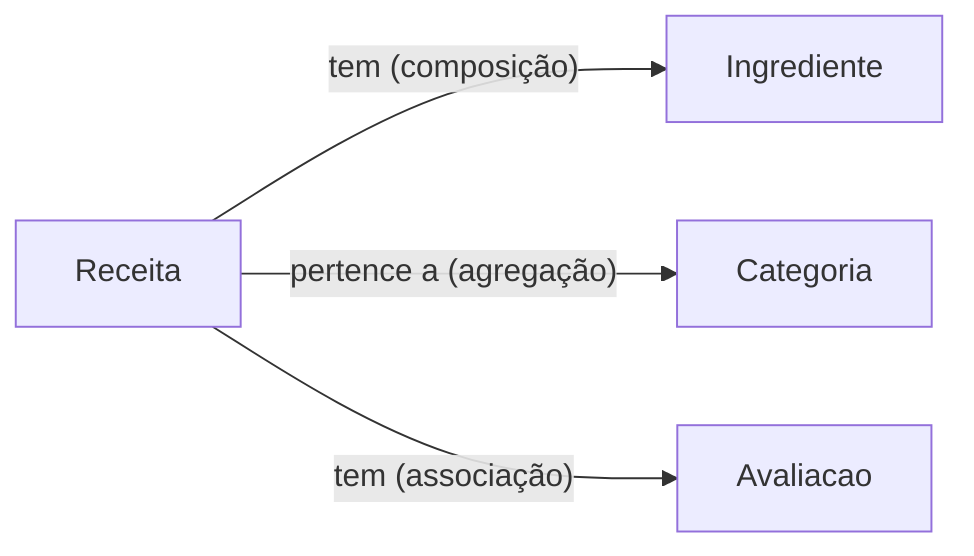

# 🥗 Cadastro de Receitas Vegetarianas

API CRUD + frontend Bootstrap para cadastrar e gerenciar receitas vegetarianas.

## 💡 Ideia do Projeto

Um sistema simples onde o usuário pode criar, visualizar, editar e excluir receitas vegetarianas. O backend expõe uma API CRUD em Node.js puro e o frontend consome essa API via Bootstrap.

---

## 🔁 Operações CRUD

| Operação   | Descrição                                    |
| ---------- | -------------------------------------------- |
| **Create** | Cadastrar uma nova receita                   |
| **Read**   | Listar todas as receitas / buscar uma por ID |
| **Update** | Editar os dados de uma receita               |
| **Delete** | Remover uma receita                          |

---

## 🏗️ Classes do Domínio

### `Receita`

- `id`
- `nome`
- `modoPreparo`
- `tempoPreparo` (em minutos)
- `porcoes`
- `categoria` → _agregação com Categoria_
- `ingredientes` → _composição com Ingrediente_
- `avaliacoes` → _associação com Avaliacao_

---

### `Ingrediente`

- `id`
- `nome`
- `quantidade`
- `unidade` (ex: gramas, xícaras, colheres)

> **Composição** — Ingrediente não existe no sistema sem uma Receita.

---

### `Categoria`

- `id`
- `nome` (ex: Lanches, sobremesas, jantas, almoços, bebidas)

> **Agregação** — Categoria existe independentemente da Receita.

---

### `Avaliacao`

- `id`
- `nota` (1 a 5)
- `comentario`

> **Associação** — Avaliacao se relaciona com Receita mas existe de forma independente.

---

## 🔗 Diagrama de Relações

---

## 🛠️ Tecnologias

- **Front-end:** HTML + Bootstrap
- **Back-end:** Node.js puro
- **Versionamento:** Git + GitHub
