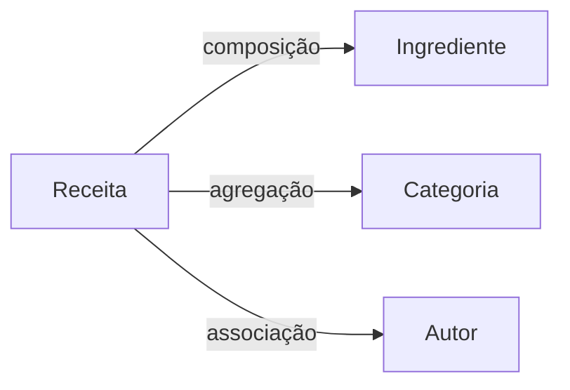
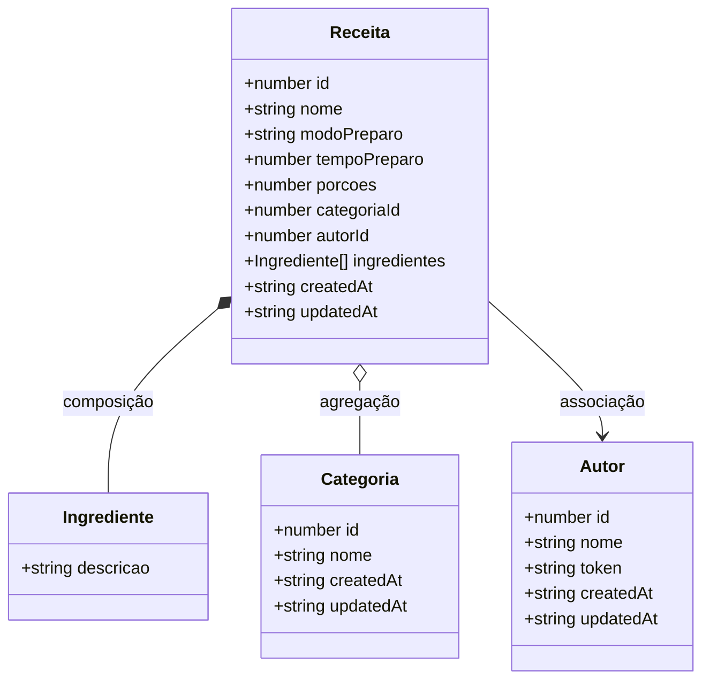

# VegRecipes

> API REST + frontend para cadastrar, gerenciar e consultar receitas vegetarianas.

---

## Sobre o Projeto

Sistema web para registro e consulta de receitas vegetarianas. O usuário pode cadastrar receitas com ingredientes, categoria e autor. O backend foi desenvolvido com Node.js e Express.js em arquitetura em camadas, com persistência em SQLite. O frontend consome a API via `fetch` com HTML5 e Bootstrap 5.

---

## Tecnologias Utilizadas

| Camada        | Tecnologia                              |
| ------------- | --------------------------------------- |
| Frontend      | HTML5 + CSS3 + Bootstrap 5 + Vanilla.js |
| Backend       | Node.js + Express.js                    |
| Persistência  | SQLite (`node:sqlite`)                  |
| Versionamento | Git + GitHub                            |

---

## Como Executar

```bash
# Entrar na pasta do backend
cd backend

# Instalar dependências
npm install

# Modo desenvolvimento (com hot reload)
npm run dev

# Produção
npm start
```

> O banco SQLite (`banco.db`) é criado automaticamente na pasta `backend/` na primeira execução, junto com as tabelas e uma seed inicial de categorias.

---

## Estrutura de Pastas

```
backend/
├── assets/                             # prints com requisições e lista de requisições no arquivo .http
├── banco.db                             # arquivo SQLite gerado na primeira execução
├── src/
│   ├── app.js                          # setup + middleware + rotas
│   ├── server.js                       # listen()
│   ├── db.js                           # conexão SQLite + criação das tabelas
│   ├── seed.js                         # popula categorias iniciais se o banco estiver vazio
│   ├── routes/
│   │   ├── receitas.js                 # path → controller
│   │   ├── categorias.js
│   │   └── autores.js
│   ├── controllers/
│   │   ├── receitaController.js        # parseia req, chama service, formata res
│   │   ├── categoriaController.js
│   │   └── autorController.js
│   ├── services/
│   │   ├── receitaService.js           # lógica de negócio pura
│   │   ├── categoriaService.js
│   │   └── autorService.js
│   ├── models/
│   │   ├── receita.js                  # queries SQL + montagem do objeto de resposta
│   │   ├── categoria.js
│   │   └── autor.js
│   └── middleware/
│       ├── logger.js
│       └── errorHandler.js
├── package.json
└── .gitignore
```

```

frontend/
├── index.html                  ← SPA com 3 abas (Bootstrap 5)
├── css/
│   └── style.css               ← Design orgânico/natural
└── js/
    ├── api.js                  ← Camada HTTP (trata 204 sem corpo)
    ├── state.js                ← Estado global compartilhado
    ├── main.js                 ← Orquestrador (init + eventos)
    ├── services/
    │   ├── categoriaService.js ← Validação + chamadas de Categoria
    │   ├── autorService.js     ← Validação + chamadas de Autor
    │   └── receitaService.js   ← Validação + chamadas de Receita
    └── ui/
        ├── categoriaView.js    ← Render + form + delete
        ├── autorView.js        ← Render + form + delete
        ├── receitaView.js      ← Render + form + delete + editar nome
        └── toast.js            ← Notificações visuais
```

**Regra de ouro (SOLID na prática):**

- **Route** → só mapeia URL para controller (não sabe de negócio)
- **Controller** → lê `req`, chama o service, monta `res` (não sabe de regras)
- **Service** → contém as regras de negócio (não sabe de HTTP, `req` ou `res`)
- **Model** → estrutura dos dados e acesso ao "banco" (não sabe de negócio nem HTTP)

---

## Modelagem do Domínio

### Entidades e seus atributos

**Receita**

```
id: number
nome: string
modoPreparo: string
tempoPreparo: number   // em minutos
porcoes: number
categoriaId: number
autorId: number         // obrigatório; exige autorToken válido na criação/edição/remoção
ingredientes: Ingrediente[]
createdAt: string
updatedAt: string
```

> Toda receita precisa de um autor. Para criar, editar ou remover uma receita é necessário enviar o `autorToken` do autor correspondente (veja a seção [Token de Autor](#token-de-autor)).

**Ingrediente**

```
descricao: string   // ex: "200 g de PTS", "2 colheres de azeite"
```

> Composição com `Receita` — ingrediente não existe sem a receita. Se a receita for deletada, seus ingredientes também são (via `ON DELETE CASCADE` no banco). Atualmente cada ingrediente é uma única string livre (quantidade + unidade + nome combinados), e não um objeto estruturado.

**Categoria**

```
id: number
nome: string   // ex: Entrada, Prato Principal, Sobremesa, Lanche
createdAt: string
updatedAt: string
```

> Agregação — categorias existem de forma independente e podem estar sem receitas associadas. Nomes duplicados (case-insensitive) são rejeitados com `409 Conflict`. Não é possível remover uma categoria com receitas vinculadas (`409 Conflict`).

**Autor**

```
id: number
nome: string    // funciona como um apelido
token: string   // gerado no POST; necessário para criar receitas em seu nome e para editar/remover suas receitas ou a si mesmo
createdAt: string
updatedAt: string
```

> Associação com `Receita` — Receita referencia o autor pelo `autorId`, mas nenhum dos dois possui o outro. Diferente do restante do domínio, Autor não tem mais `email`: o cadastro é feito só com um apelido. O `token` é retornado **apenas** na resposta do `POST /autores` — não aparece em listagens nem em buscas por ID. Quem não guardar o token não conseguirá cadastrar receitas em nome desse autor, nem editar/remover suas receitas, nem editar/remover o próprio autor.

---

### Diagrama de Relações



### Diagrama UML de Classes



---

## Princípios SOLID Aplicados

### SRP — Single Responsibility Principle

Cada arquivo tem uma única razão para mudar:

| Arquivo                              | Responsabilidade                                           |
| ------------------------------------ | ---------------------------------------------------------- |
| `db.js`                              | Conexão com o SQLite e criação das tabelas                 |
| `seed.js`                            | Popula categorias iniciais se o banco estiver vazio        |
| `models/receita.js`                  | Queries SQL e montagem do objeto de resposta de receitas   |
| `models/categoria.js`                | Queries SQL e montagem do objeto de resposta de categorias |
| `models/autor.js`                    | Queries SQL e montagem do objeto de resposta de autores    |
| `services/receitaService.js`         | Regras de negócio de receitas                              |
| `services/categoriaService.js`       | Regras de negócio de categorias                            |
| `services/autorService.js`           | Regras de negócio de autores                               |
| `controllers/receitaController.js`   | Interface HTTP de receitas                                 |
| `controllers/categoriaController.js` | Interface HTTP de categorias                               |
| `controllers/autorController.js`     | Interface HTTP de autores                                  |
| `routes/receitas.js`                 | Mapeamento de URLs para controllers de receitas            |
| `routes/categorias.js`               | Mapeamento de URLs para controllers de categorias          |
| `routes/autores.js`                  | Mapeamento de URLs para controllers de autores             |
| `middleware/logger.js`               | Log de requisições                                         |
| `middleware/errorHandler.js`         | Tratamento centralizado de erros                           |

---

### DIP — Dependency Inversion Principle

O fluxo de uma requisição percorre as camadas sem que nenhuma delas precise conhecer os detalhes das outras:

```
Request HTTP
    │
    ▼
  Route        →  "POST /receitas vai para receitaController.criar"
    │
    ▼
  Controller   →  lê req.body, chama receitaService.criar(dados)
    │
    ▼
  Service      →  valida (nome? categoria existe? autorToken válido?), chama receitaModel.inserir(dados)
    │
    ▼
  Model        →  insere a receita e os ingredientes no SQLite, retorna o objeto criado
    │
    ▼
  Controller   →  recebe o resultado, faz res.status(201).json(resultado)
    │
    ▼
Response HTTP
```

**Benefícios concretos:**

- Para trocar o banco de dados, muda **só os models**
- Para adicionar uma regra de negócio, muda **só os services**
- Para mudar a URL de um endpoint, muda **só as routes**
- Para testar lógica de negócio, testa **só os services** (sem HTTP!)

---

## Endpoints da API

### Receitas

| Método | Rota                     | Ação                                                                       | Status de Retorno                                                                      |
| ------ | ------------------------ | -------------------------------------------------------------------------- | -------------------------------------------------------------------------------------- |
| GET    | `/receitas`              | Lista receitas (com filtros e paginação)                                   | `200 OK`                                                                               |
| GET    | `/receitas/estatisticas` | Retorna total de receitas, contagem por categoria e tempo médio de preparo | `200 OK`                                                                               |
| GET    | `/receitas/:id`          | Busca uma receita por ID                                                   | `200 OK` / `404 Not Found`                                                             |
| POST   | `/receitas`              | Cria uma nova receita (requer `autorToken`)                                | `201 Created` / `400 Bad Request` / `403 Forbidden` / `422 Unprocessable`              |
| PUT    | `/receitas/:id`          | Atualiza uma receita (requer `autorToken`)                                 | `200 OK` / `400 Bad Request` / `403 Forbidden` / `404 Not Found` / `422 Unprocessable` |
| DELETE | `/receitas/:id`          | Remove uma receita (requer `autorToken`)                                   | `204 No Content` / `400 Bad Request` / `403 Forbidden` / `404 Not Found`               |

> `GET /receitas` aceita os parâmetros de query `nome`, `categoriaId`, `ordenarPor` (`nome`, `tempo_preparo`, `created_at` ou `id`), `ordem` (`ASC`/`DESC`), `limit` e `offset`. A resposta tem o formato `{ dados: [...], paginacao: { total, limit, offset, paginas } }`.

### Categorias

| Método | Rota              | Ação                       | Status de Retorno                                               |
| ------ | ----------------- | -------------------------- | --------------------------------------------------------------- |
| GET    | `/categorias`     | Lista todas as categorias  | `200 OK`                                                        |
| GET    | `/categorias/:id` | Busca uma categoria por ID | `200 OK` / `404 Not Found`                                      |
| POST   | `/categorias`     | Cria uma nova categoria    | `201 Created` / `400 Bad Request` / `409 Conflict`              |
| PUT    | `/categorias/:id` | Atualiza uma categoria     | `200 OK` / `400 Bad Request` / `404 Not Found` / `409 Conflict` |
| DELETE | `/categorias/:id` | Remove uma categoria       | `204 No Content` / `404 Not Found` / `409 Conflict`             |

> Nome duplicado (case-insensitive) ou remoção de categoria com receitas vinculadas retornam `409 Conflict`.

### Autores

| Método | Rota           | Ação                                   | Status de Retorno                                                                         |
| ------ | -------------- | -------------------------------------- | ----------------------------------------------------------------------------------------- |
| GET    | `/autores`     | Lista todos os autores                 | `200 OK`                                                                                  |
| GET    | `/autores/:id` | Busca um autor por ID                  | `200 OK` / `404 Not Found`                                                                |
| POST   | `/autores`     | Cria um novo autor (retorna o `token`) | `201 Created` / `400 Bad Request`                                                         |
| PUT    | `/autores/:id` | Atualiza um autor (requer `token`)     | `200 OK` / `400 Bad Request` / `403 Forbidden` / `404 Not Found`                          |
| DELETE | `/autores/:id` | Remove um autor (requer `token`)       | `204 No Content` / `400 Bad Request` / `403 Forbidden` / `404 Not Found` / `409 Conflict` |

> Remover um autor que possui receitas vinculadas retorna `409 Conflict`.

---

## Token de Autor

A API usa um sistema de **token por autor** no lugar de autenticação tradicional. Para publicar receitas é preciso primeiro existir como autor: ao criar um autor (`POST /autores`), a resposta traz um `token` que funciona como "senha" desse autor. Esse token é necessário para:

- Criar uma receita em nome desse autor (`autorToken` no `POST /receitas`)
- Editar ou remover uma receita desse autor (`autorToken` no `PUT`/`DELETE /receitas/:id`)
- Editar ou remover o próprio autor (`token` no `PUT`/`DELETE /autores/:id`)

**Fluxo:**

```
POST /autores
{ "nome": "Diogo" }
→ { id: 1, nome: "Diogo", token: "A1B2C3D4", ... }   ← guarde este token!

POST /receitas
{ "nome": "PTS ao molho", ..., "autorId": 1, "autorToken": "A1B2C3D4" }

PUT /receitas/1
{ "autorToken": "A1B2C3D4", "nome": "novo nome" }

DELETE /receitas/1
{ "autorToken": "A1B2C3D4" }
```

**Comportamento:**

- `token` aparece **apenas** na resposta do `POST /autores`
- GET `/autores` e GET `/autores/:id` **não expõem** o token
- Token errado ou ausente retorna `403 Forbidden` (ou `400 Bad Request` se nem foi enviado)
- `autorId` é obrigatório em toda receita — não é possível cadastrar uma receita sem autor
- Como os dados ficam no SQLite, os tokens **persistem** entre reinicializações do servidor (diferente da versão anterior, in-memory)

---

## Operações CRUD

| Operação | Descrição                                                   |
| -------- | ----------------------------------------------------------- |
| Create   | Cadastrar uma nova receita (requer `autorToken`)            |
| Read     | Listar receitas com filtros e paginação / buscar uma por ID |
| Update   | Editar os dados de uma receita (requer `autorToken`)        |
| Delete   | Remover uma receita (requer `autorToken`)                   |

---

## Testes da API

Os endpoints podem ser testados com **Thunder Client** (extensão do VS Code) ou via **curl**:

```bash
# Listar todas as receitas
curl http://localhost:3000/receitas

# Criar um autor (guarde o token da resposta!)
curl -X POST http://localhost:3000/autores \
  -H "Content-Type: application/json" \
  -d '{"nome": "Diogo"}'

# Criar uma receita (autorId e autorToken são obrigatórios)
curl -X POST http://localhost:3000/receitas \
  -H "Content-Type: application/json" \
  -d '{"nome": "PTS ao molho", "modoPreparo": "...", "tempoPreparo": 30, "porcoes": 4, "categoriaId": 1, "autorId": 1, "autorToken": "token-gerado"}'

# Atualizar uma receita
curl -X PUT http://localhost:3000/receitas/1 \
  -H "Content-Type: application/json" \
  -d '{"autorToken": "token-gerado", "nome": "PTS ao molho apimentado"}'

# Deletar uma receita
curl -X DELETE http://localhost:3000/receitas/1 \
  -H "Content-Type: application/json" \
  -d '{"autorToken": "token-gerado"}'
```

---

## Git Workflow

```
main           ← produção
  └── develop  ← integração
       └── feature/banco-de-dados ← branch atual
```

**Fluxo adotado:**

1. Criar branch `feature/modelagem` a partir de `develop`
2. Commitar a modelagem nessa branch
3. Abrir Pull Request de `feature/modelagem` → `develop`
4. Após revisão, merge em `develop`
