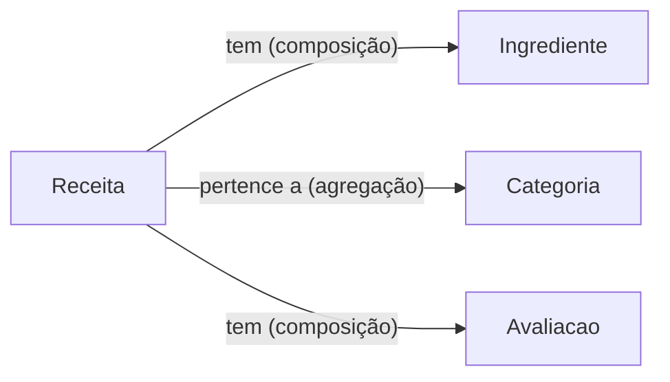
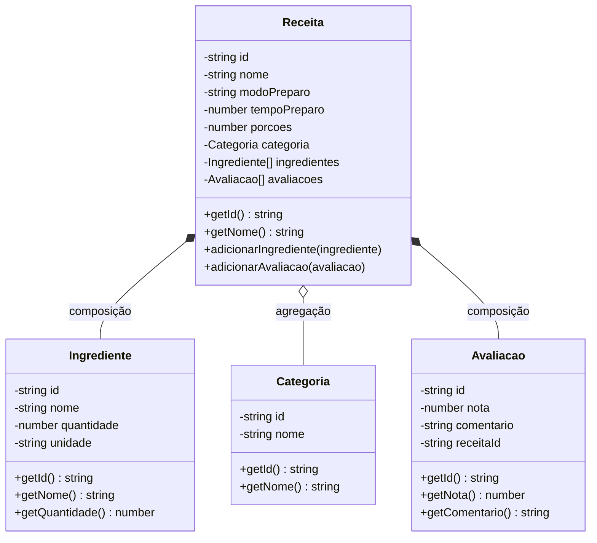
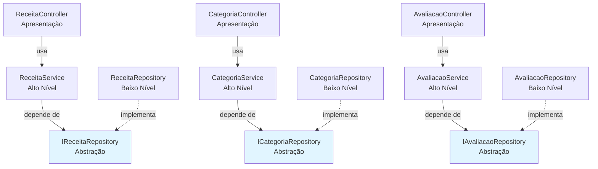

# 🥗 Cadastro de Receitas Vegetarianas

API CRUD + frontend Bootstrap para cadastrar e gerenciar receitas vegetarianas.

## 💡 Ideia do Projeto

Um sistema simples onde o usuário pode criar, visualizar, editar e excluir receitas vegetarianas. O backend expõe uma API REST usando Node.js puro (módulo `http` nativo) + TypeScript e o frontend consome essa API com HTML + Bootstrap puro.

---

## 🧱 Princípios de Design

### SRP (Single Responsibility Principle)

Cada classe possui uma única responsabilidade bem definida.

### DIP (Dependency Inversion Principle)

Services dependem de abstrações (interfaces de repositório), não de implementações concretas.

---

## 🔀 Git Workflow

- **main** → produção
- **develop** → integração
- **feature/modelagem** → modelagem do domínio

---

## 🔁 Operações CRUD

| Operação   | Descrição                                    |
| ---------- | -------------------------------------------- |
| **Create** | Cadastrar uma nova receita                   |
| **Read**   | Listar todas as receitas / buscar uma por ID |
| **Update** | Editar os dados de uma receita               |
| **Delete** | Remover uma receita                          |

---

## 🏗️ Classes do Domínio

### `Receita`

- `id: string`
- `nome: string`
- `modoPreparo: string`
- `tempoPreparo: number` (em minutos)
- `porcoes: number`
- `categoria: Categoria` → _agregação com Categoria_
- `ingredientes: Ingrediente[]` → _composição com Ingrediente_
- `avaliacoes: Avaliacao[]` → _composição com Avaliacao_

---

### `Ingrediente`

- `id: string`
- `nome: string`
- `quantidade: number`
- `unidade: string` (ex: gramas, xícaras, colheres)

> **Composição** — Ingrediente não existe no sistema sem uma Receita. Quando a receita é deletada, seus ingredientes também são.

---

### `Categoria`

- `id: string`
- `nome: string` (ex: Lanches, Sobremesas, Jantas, Almoços, Bebidas)

> **Agregação** — Categoria existe independentemente da Receita. Pode haver categorias sem receitas associadas.

---

### `Avaliacao`

- `id: string`
- `nota: number` (1 a 5)
- `comentario: string`
- `receitaId: string`

> **Composição** — Avaliacao pertence a uma Receita específica. Quando a receita é deletada, suas avaliações também são removidas.

---

## 🔗 Diagrama de Relações entre Entidades



---

## 📐 Diagrama UML de Classes



---

## 🏛️ Arquitetura e Princípios SOLID

### Estrutura em Camadas

```
src/
├── domain/              # Camada de Domínio (Entidades)
│   ├── Receita.ts
│   ├── Ingrediente.ts
│   ├── Categoria.ts
│   └── Avaliacao.ts
│
├── repositories/        # Camada de Persistência
│   ├── interfaces/
│   │   ├── IReceitaRepository.ts
│   │   ├── ICategoriaRepository.ts
│   │   └── IAvaliacaoRepository.ts
│   ├── ReceitaRepository.ts
│   ├── CategoriaRepository.ts
│   └── AvaliacaoRepository.ts
│
├── services/           # Camada de Lógica de Negócio
│   ├── ReceitaService.ts
│   ├── CategoriaService.ts
│   └── AvaliacaoService.ts
│
└── controllers/        # Camada de Apresentação (API REST)
    ├── ReceitaController.ts
    ├── CategoriaController.ts
    └── AvaliacaoController.ts
```

---

### 📌 Aplicação do SRP (Single Responsibility Principle)

| Classe                | Responsabilidade Única                                  | Motivo para Mudar                           |
| --------------------- | ------------------------------------------------------- | ------------------------------------------- |
| `Receita`             | Representar os dados de uma receita                     | Mudança nos atributos da receita            |
| `Ingrediente`         | Representar os dados de um ingrediente                  | Mudança nos atributos do ingrediente        |
| `Categoria`           | Representar os dados de uma categoria                   | Mudança nos atributos da categoria          |
| `Avaliacao`           | Representar os dados de uma avaliação                   | Mudança nos atributos da avaliação          |
| `ReceitaRepository`   | Persistir e recuperar receitas do armazenamento         | Mudança na forma de persistência (JSON, DB) |
| `CategoriaRepository` | Persistir e recuperar categorias do armazenamento       | Mudança na forma de persistência            |
| `AvaliacaoRepository` | Persistir e recuperar avaliações do armazenamento       | Mudança na forma de persistência            |
| `ReceitaService`      | Orquestrar a lógica de negócio relacionada a receitas   | Mudança nas regras de negócio de receitas   |
| `CategoriaService`    | Orquestrar a lógica de negócio relacionada a categorias | Mudança nas regras de negócio de categorias |
| `AvaliacaoService`    | Orquestrar a lógica de negócio relacionada a avaliações | Mudança nas regras de negócio de avaliações |
| `ReceitaController`   | Receber requisições HTTP e retornar respostas           | Mudança no formato da API REST              |
| `CategoriaController` | Receber requisições HTTP e retornar respostas           | Mudança no formato da API REST              |
| `AvaliacaoController` | Receber requisições HTTP e retornar respostas           | Mudança no formato da API REST              |

---

### 🔄 Aplicação do DIP (Dependency Inversion Principle)

#### Diagrama de Dependências (Setas → Abstrações)



#### Onde o DIP será aplicado:

**1. ReceitaService depende de IReceitaRepository (abstração)**

- Sem DIP: `ReceitaService` instancia diretamente `ReceitaRepository`
- Com DIP: `ReceitaService` recebe `IReceitaRepository` no construtor (injeção de dependência)

**2. CategoriaService depende de ICategoriaRepository (abstração)**

- Sem DIP: `CategoriaService` instancia diretamente `CategoriaRepository`
- Com DIP: `CategoriaService` recebe `ICategoriaRepository` no construtor

**3. AvaliacaoService depende de IAvaliacaoRepository (abstração)**

- Sem DIP: `AvaliacaoService` instancia diretamente `AvaliacaoRepository`
- Com DIP: `AvaliacaoService` recebe `IAvaliacaoRepository` no construtor

---

## 🎨 Frontend (Bootstrap Puro)

Interface web usando apenas HTML5, CSS3 e Bootstrap 5.

**Estrutura do frontend:**

```
frontend/
├── index.html              # Página principal (lista de receitas)
├── cadastro.html           # Formulário de cadastro
├── detalhes.html           # Detalhes de uma receita
├── css/
│   └── custom.css          # Estilos personalizados
└── js/
    └── app.js              # JavaScript vanilla (fetch API)
```

---

## 🔌 Endpoints da API

### Receitas

| Método   | Endpoint        | Descrição                |
| -------- | --------------- | ------------------------ |
| `GET`    | `/receitas`     | Lista todas as receitas  |
| `GET`    | `/receitas/:id` | Busca uma receita por ID |
| `POST`   | `/receitas`     | Cria uma nova receita    |
| `PUT`    | `/receitas/:id` | Atualiza uma receita     |
| `DELETE` | `/receitas/:id` | Remove uma receita       |

### Categorias

| Método   | Endpoint          | Descrição                  |
| -------- | ----------------- | -------------------------- |
| `GET`    | `/categorias`     | Lista todas as categorias  |
| `GET`    | `/categorias/:id` | Busca uma categoria por ID |
| `POST`   | `/categorias`     | Cria uma nova categoria    |
| `PUT`    | `/categorias/:id` | Atualiza uma categoria     |
| `DELETE` | `/categorias/:id` | Remove uma categoria       |

### Avaliações

| Método   | Endpoint                   | Descrição                        |
| -------- | -------------------------- | -------------------------------- |
| `GET`    | `/receitas/:id/avaliacoes` | Lista avaliações de uma receita  |
| `POST`   | `/receitas/:id/avaliacoes` | Adiciona avaliação a uma receita |
| `DELETE` | `/avaliacoes/:id`          | Remove uma avaliação             |

---

## 🛠️ Tecnologias

- **Front-end:** HTML5 + CSS3 + Bootstrap 5
- **Back-end:** Node.js puro + TypeScript
- **Servidor HTTP:** Módulo `http` nativo do Node.js
- **Persistência:** JSON (futuro: MongoDB)
- **Versionamento:** Git + GitHub
- **Arquitetura:** Camadas (Domain, Repository, Service, Controller)
- **Princípios:** SOLID (SRP, DIP)

---

## 📝 Fluxo de Desenvolvimento (Git Workflow)

```
main (produção)
  └── develop (integração)
       └── feature/modelagem (trabalho atual)
```

**Branches:**

- `main`: código em produção
- `develop`: integração de features
- `feature/modelagem`: modelagem da arquitetura

**Scripts no package.json:**

```json
{
  "scripts": {
    "dev": "nodemon --exec ts-node src/index.ts",
    "build": "tsc",
    "start": "node dist/index.js"
  }
}
```
