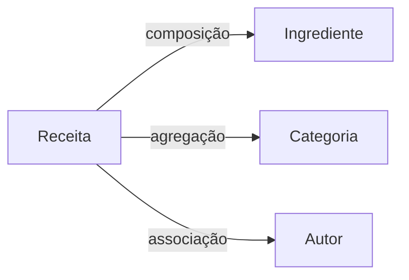
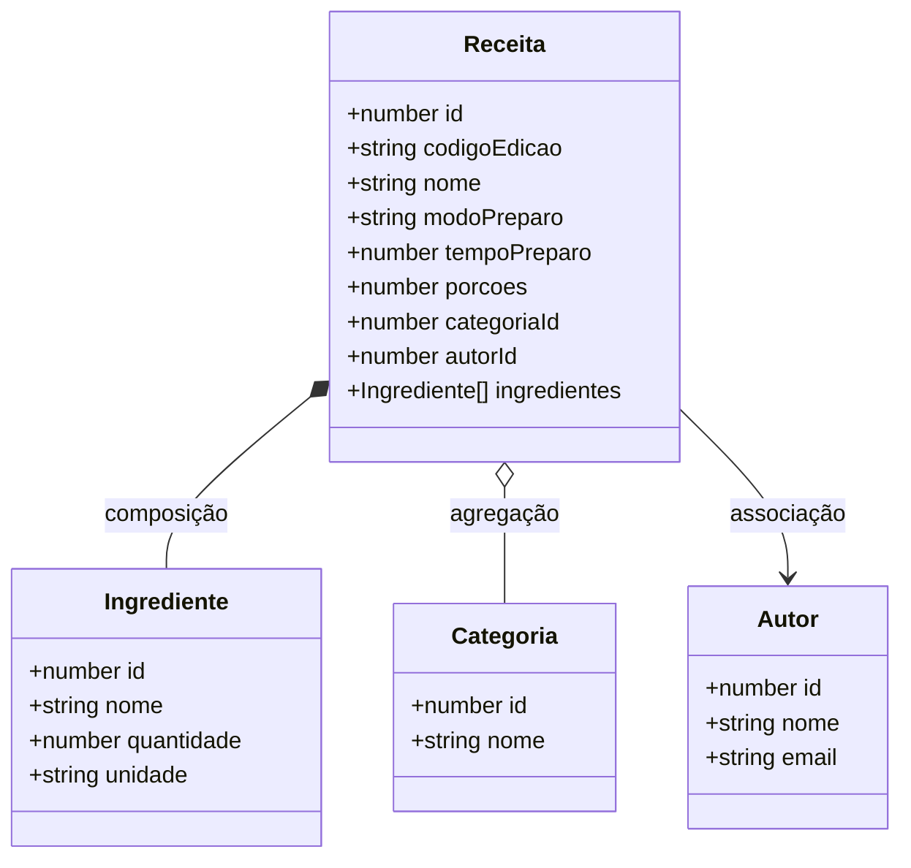

# VegRecipes

> API REST + frontend para cadastrar, gerenciar e consultar receitas vegetarianas.

---

## Sobre o Projeto

Sistema web para registro e consulta de receitas vegetarianas. O usuário pode cadastrar receitas com ingredientes e categorias. O backend foi desenvolvido com Node.js e Express.js em arquitetura em camadas. O frontend consome a API via `fetch` com HTML5 e Bootstrap 5.

---

## Tecnologias Utilizadas

| Camada        | Tecnologia                      |
| ------------- | ------------------------------- |
| Frontend      | HTML5 + CSS3 + Bootstrap 5      |
| Backend       | Node.js + Express.js            |
| Persistência  | In-memory (futuramente MongoDB) |
| Versionamento | Git + GitHub                    |

---

## Como Executar

```bash
# Instalar dependências
npm install

# Modo desenvolvimento (com hot reload)
npm run dev

# Produção
npm start
```

---

## Estrutura de Pastas

```
receitas-api/
├── assets/                             # prints com requisições e lista de requisições no arquivo .http
├── src/
│   ├── app.js                          # setup + middleware + rotas
│   ├── server.js                       # listen()
│   ├── routes/
│   │   ├── receitas.js                 # path → controller
│   │   ├── categorias.js
│   │   └── autores.js
│   ├── controllers/
│   │   ├── receitaController.js        # parseia req, chama service, formata res
│   │   ├── categoriaController.js
│   │   └── autorController.js
│   ├── services/
│   │   ├── receitaService.js           # lógica de negócio pura
│   │   ├── categoriaService.js
│   │   └── autorService.js
│   ├── models/
│   │   ├── receita.js                  # estrutura de dados + repositório in-memory
│   │   ├── categoria.js
│   │   └── autor.js
│   └── middleware/
│       ├── logger.js
│       └── errorHandler.js
├── package.json
└── .gitignore
```

**Regra de ouro (SOLID na prática):**

- **Route** → só mapeia URL para controller (não sabe de negócio)
- **Controller** → lê `req`, chama o service, monta `res` (não sabe de regras)
- **Service** → contém as regras de negócio (não sabe de HTTP, `req` ou `res`)
- **Model** → estrutura dos dados e acesso ao "banco" (não sabe de negócio nem HTTP)

---

## Modelagem do Domínio

### Entidades e seus atributos

**Receita**

```
id: number
codigoEdicao: string   // UUID gerado no POST; necessário para editar ou deletar
nome: string
modoPreparo: string
tempoPreparo: number   // em minutos
porcoes: number
categoriaId: number
autorId: number | null // opcional
ingredientes: Ingrediente[]
```

> `codigoEdicao` é retornado **apenas** na resposta do `POST /receitas`. Não aparece em listagens nem em buscas por ID. Quem não guardar o código não poderá editar ou deletar a receita.

**Ingrediente**

```
id: number
nome: string
quantidade: number
unidade: string   // ex: gramas, xícaras, colheres
```

> Composição com `Receita` — ingrediente não existe sem a receita. Se a receita for deletada, seus ingredientes também são.

**Categoria**

```
id: number
nome: string   // ex: Lanches, Sobremesas, Almoços, Bebidas
```

> Agregação — categorias existem de forma independente e podem estar sem receitas associadas.

**Autor**

```
id: number
nome: string
email: string
```

> Associação com `Receita` — Receita referencia o autor pelo `autorId`, mas nenhum dos dois possui o outro. Autor existe independentemente e pode não ter receitas; Receita pode existir sem um autor cadastrado (`autorId` é opcional).

---

### Diagrama de Relações



### Diagrama UML de Classes



---

## Princípios SOLID Aplicados

### SRP — Single Responsibility Principle

Cada arquivo tem uma única razão para mudar:

| Arquivo                              | Responsabilidade                                                   |
| ------------------------------------ | ------------------------------------------------------------------ |
| `models/receita.js`                  | Estrutura de dados e acesso ao repositório in-memory de receitas   |
| `models/categoria.js`                | Estrutura de dados e acesso ao repositório in-memory de categorias |
| `models/autor.js`                    | Estrutura de dados e acesso ao repositório in-memory de autores    |
| `services/receitaService.js`         | Regras de negócio de receitas                                      |
| `services/categoriaService.js`       | Regras de negócio de categorias                                    |
| `services/autorService.js`           | Regras de negócio de autores                                       |
| `controllers/receitaController.js`   | Interface HTTP de receitas                                         |
| `controllers/categoriaController.js` | Interface HTTP de categorias                                       |
| `controllers/autorController.js`     | Interface HTTP de autores                                          |
| `routes/receitas.js`                 | Mapeamento de URLs para controllers de receitas                    |
| `routes/categorias.js`               | Mapeamento de URLs para controllers de categorias                  |
| `routes/autores.js`                  | Mapeamento de URLs para controllers de autores                     |
| `middleware/logger.js`               | Log de requisições                                                 |
| `middleware/errorHandler.js`         | Tratamento centralizado de erros                                   |

---

### DIP — Dependency Inversion Principle

O fluxo de uma requisição percorre as camadas sem que nenhuma delas precise conhecer os detalhes das outras:

```
Request HTTP
    │
    ▼
  Route        →  "POST /receitas vai para receitaController.criar"
    │
    ▼
  Controller   →  lê req.body, chama receitaService.criar(dados)
    │
    ▼
  Service      →  valida (nome? categoria existe?), chama receitaModel.inserir(dados)
    │
    ▼
  Model        →  insere no array, gera codigoEdicao, retorna o objeto criado
    │
    ▼
  Controller   →  recebe o resultado, faz res.status(201).json(resultado)
    │
    ▼
Response HTTP
```

**Benefícios concretos:**

- Para trocar o banco de dados, muda **só os models**
- Para adicionar uma regra de negócio, muda **só os services**
- Para mudar a URL de um endpoint, muda **só as routes**
- Para testar lógica de negócio, testa **só os services** (sem HTTP!)

---

## Endpoints da API

### Receitas

| Método | Rota            | Ação                     | Status de Retorno                                                        |
| ------ | --------------- | ------------------------ | ------------------------------------------------------------------------ |
| GET    | `/receitas`     | Lista todas as receitas  | `200 OK`                                                                 |
| GET    | `/receitas/:id` | Busca uma receita por ID | `200 OK` / `404 Not Found`                                               |
| POST   | `/receitas`     | Cria uma nova receita    | `201 Created` / `400 Bad Request` / `422 Unprocessable`                  |
| PUT    | `/receitas/:id` | Atualiza uma receita     | `200 OK` / `400 Bad Request` / `403 Forbidden` / `404 Not Found`         |
| DELETE | `/receitas/:id` | Remove uma receita       | `204 No Content` / `400 Bad Request` / `403 Forbidden` / `404 Not Found` |

### Categorias

| Método | Rota              | Ação                       | Status de Retorno                  |
| ------ | ----------------- | -------------------------- | ---------------------------------- |
| GET    | `/categorias`     | Lista todas as categorias  | `200 OK`                           |
| GET    | `/categorias/:id` | Busca uma categoria por ID | `200 OK` / `404 Not Found`         |
| POST   | `/categorias`     | Cria uma nova categoria    | `201 Created` / `400 Bad Request`  |
| PUT    | `/categorias/:id` | Atualiza uma categoria     | `200 OK` / `404 Not Found`         |
| DELETE | `/categorias/:id` | Remove uma categoria       | `204 No Content` / `404 Not Found` |

### Autores

| Método | Rota           | Ação                   | Status de Retorno                  |
| ------ | -------------- | ---------------------- | ---------------------------------- |
| GET    | `/autores`     | Lista todos os autores | `200 OK`                           |
| GET    | `/autores/:id` | Busca um autor por ID  | `200 OK` / `404 Not Found`         |
| POST   | `/autores`     | Cria um novo autor     | `201 Created` / `400 Bad Request`  |
| PUT    | `/autores/:id` | Atualiza um autor      | `200 OK` / `404 Not Found`         |
| DELETE | `/autores/:id` | Remove um autor        | `204 No Content` / `404 Not Found` |

---

## Código de Edição

Receitas usam um sistema de **código de edição** no lugar de autenticação. Qualquer pessoa pode criar uma receita — ao fazer isso, recebe um `codigoEdicao` (UUID) na resposta. Esse código é necessário para editar ou deletar a receita depois.

**Fluxo:**

```
POST /receitas  →  { ...receita, codigoEdicao: "uuid-gerado" }  ← guarde este código!

PUT /receitas/1
{ "codigoEdicao": "uuid-gerado", "nome": "novo nome" }

DELETE /receitas/1
{ "codigoEdicao": "uuid-gerado" }
```

**Comportamento:**

- `codigoEdicao` aparece **apenas** na resposta do `POST`
- GET `/receitas` e GET `/receitas/:id` **não expõem** o código
- Código errado ou ausente retorna `403 Forbidden`
- Como os dados são in-memory, os códigos são perdidos ao reiniciar o servidor

---

## Operações CRUD

| Operação | Descrição                                      |
| -------- | ---------------------------------------------- |
| Create   | Cadastrar uma nova receita                     |
| Read     | Listar todas as receitas / buscar uma por ID   |
| Update   | Editar os dados de uma receita (requer código) |
| Delete   | Remover uma receita (requer código)            |

---

## Testes da API

Os endpoints podem ser testados com **Thunder Client** (extensão do VS Code) ou via **curl**:

```bash
# Listar todas as receitas
curl http://localhost:3000/receitas

# Criar uma receita (guarde o codigoEdicao da resposta!)
curl -X POST http://localhost:3000/receitas \
  -H "Content-Type: application/json" \
  -d '{"nome": "PTS ao molho", "modoPreparo": "...", "tempoPreparo": 30, "porcoes": 4, "categoriaId": 1}'

# Atualizar uma receita
curl -X PUT http://localhost:3000/receitas/1 \
  -H "Content-Type: application/json" \
  -d '{"codigoEdicao": "uuid-gerado", "nome": "PTS ao molho apimentado"}'

# Deletar uma receita
curl -X DELETE http://localhost:3000/receitas/1 \
  -H "Content-Type: application/json" \
  -d '{"codigoEdicao": "uuid-gerado"}'
```

---

## Git Workflow

```
main           ← produção
  └── develop  ← integração
       └── feature/modelagem  ← branch atual
```

**Fluxo adotado:**

1. Criar branch `feature/modelagem` a partir de `develop`
2. Commitar a modelagem nessa branch
3. Abrir Pull Request de `feature/modelagem` → `develop`
4. Após revisão, merge em `develop`
